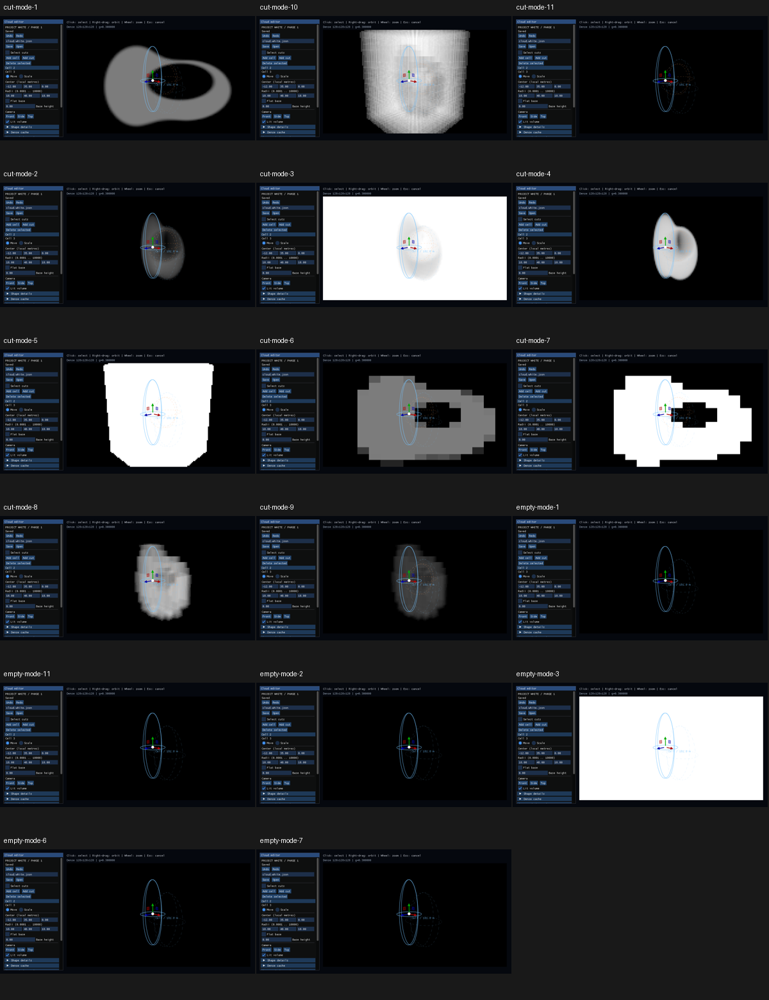

# Diagnostic views: actual Windows CI captures

Native build run [35423972606](https://github.com/MasafumiYamaguchi/Testbed/actions/runs/35423972606), PR #72 head `84a85bfe1d402047aed30bfb096ab49448ecddf9`. Debug/Release Windows and debug/release CPU jobs passed. Captures use hosted Windows D3D12 (WARP); physical GPU performance remains deferred.

All 11 cut views and six empty-medium views were visually reviewed. Density slice/cut, tau, sun T, single-scattering, AABB, conservative majorant, occupancy, evaluation counts, skipping counts and violation display show their expected distinct fields. Mode 11 has no magenta violations. Empty analytic checks inspect all 14,400 pixels per case: zero fields except sun transmittance one. Diagnostic normalization is documented in metadata; raw EXR remains in the workflow artifact.

