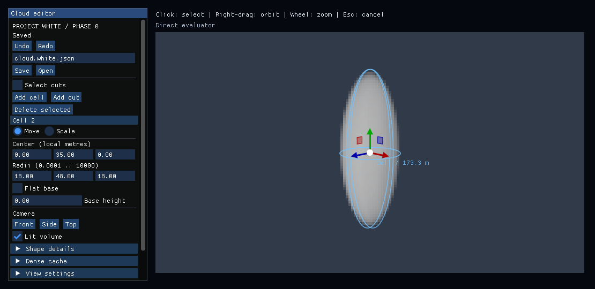
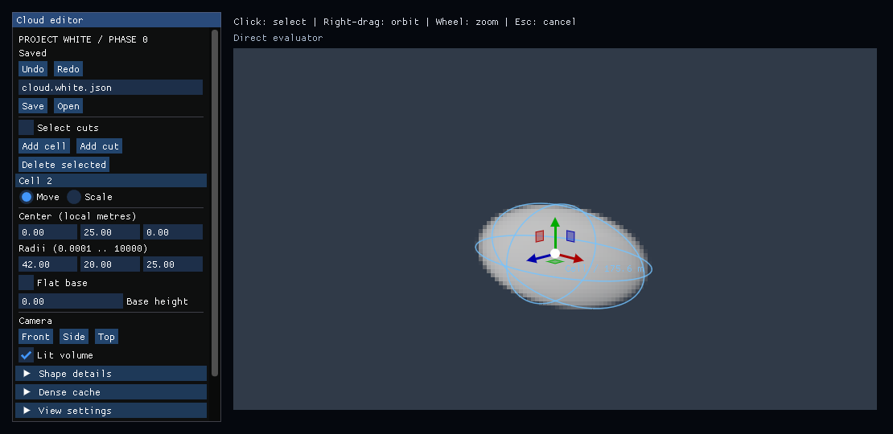
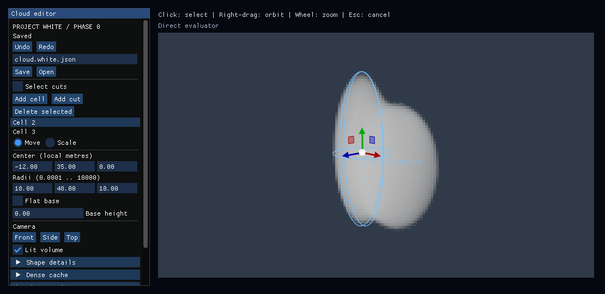
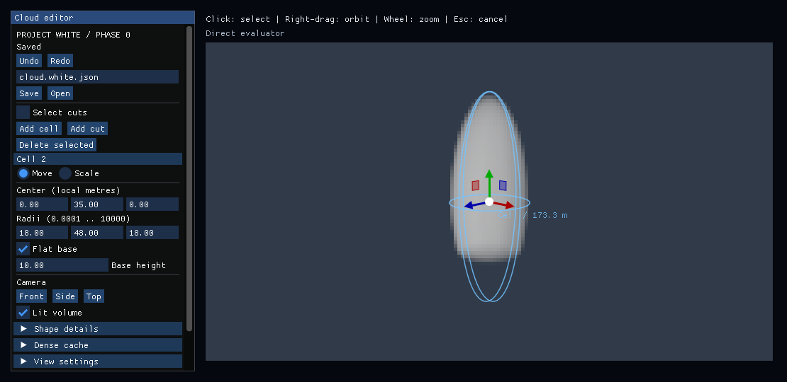
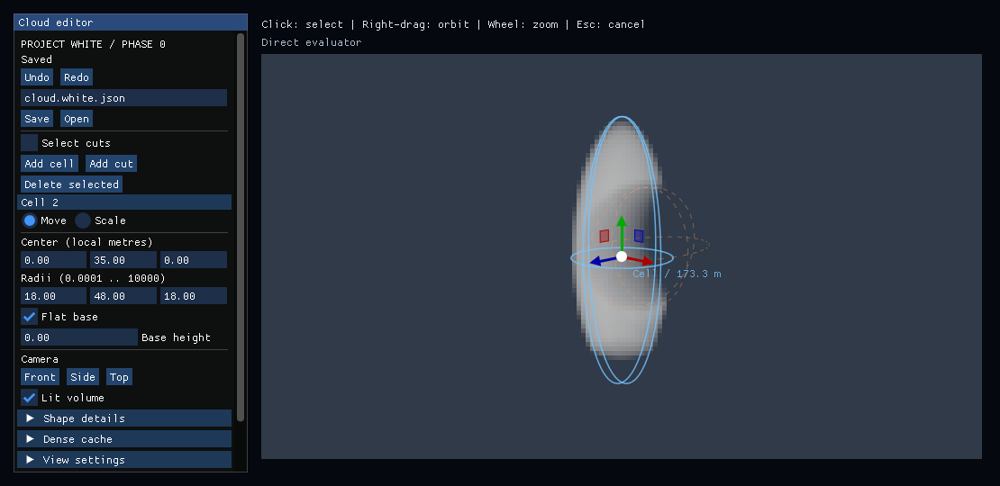
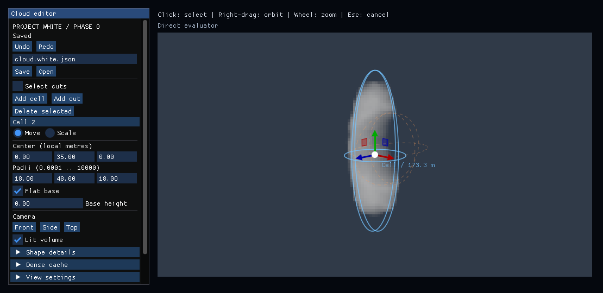
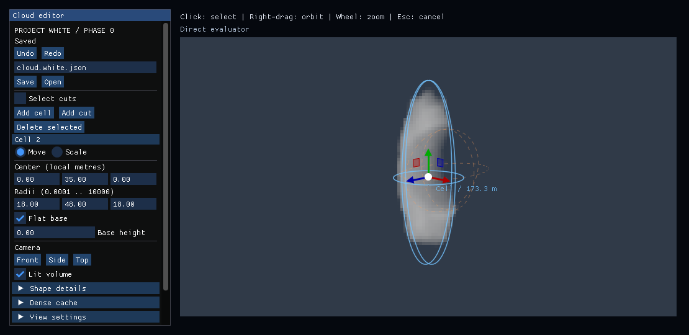

# Verified fixed-recipe captures

Code commit `fd17eccd7354ffd8f9193bdb43f6298ccd92c6d6`.
[Windows Debug/Release + CPU Actions](https://github.com/MasafumiYamaguchi/Testbed/actions/runs/35420646155): all jobs passed.
All 31 PNGs were opened for visual review. Each capture reports 160×90,
64 view steps, 8 shadow steps, and no pending bake. Full Scene inputs live in
`tests/fixtures/gate/`; `recipe-sha256.csv` records the captured copies.

| Case | 128³ T max vs direct | 128³ T mean | 128³ sampler error | 256³ T max vs direct | 256³ T mean | 256³ sampler error |
|---|---:|---:|---:|---:|---:|---:|
| tall | 0.00717344 | 8.79066e-05 | 9.31899e-05 | 0.0023497 | 2.33509e-05 | 4.40543e-05 |
| wide | 0.0148694 | 0.000100648 | 0.000129456 | 0.00386962 | 2.63098e-05 | 9.19046e-05 |
| fusion | 0.0096449 | 0.000118449 | 0.000154861 | 0.00266222 | 3.28993e-05 | 7.37931e-05 |
| flat-base | 0.00675824 | 7.78535e-05 | 9.31899e-05 | 0.0023497 | 2.14006e-05 | 5.18146e-05 |
| cut | 0.00717344 | 8.25534e-05 | 9.31881e-05 | 0.0023497 | 2.23415e-05 | 4.4933e-05 |
| detail-17 | 0.00689995 | 6.90938e-05 | 7.50638e-05 | 0.00184089 | 1.85524e-05 | 3.85399e-05 |
| detail-18 | 0.00770327 | 6.9523e-05 | 9.59077e-05 | 0.00240949 | 1.9198e-05 | 4.02564e-05 |

Values are linear transmittance differences, not differences after tone mapping.
Every direct image passed the separate CPU reference check (largest error
2.53313e-6). The largest cache sampler-reference error is 0.000154861.
The lower 256³ errors do not establish physical-GPU speed or memory residency.

Visual review: tall/wide and fusion silhouettes differ as intended; the flat
base and cut remain visible from the saved views. Detail seeds keep the saved
cell/cut structure. Cache images retain these operations with slight edge changes.
The 160×90 preview shows visible pixel steps, and smooth primitives remain a
procedural PoC rather than a finished cloud look. Gate remains **Hold**.

## Saved direct images

### tall

### wide

### fusion

### flat-base

### cut

### detail-17

### detail-18

All front/side and cached images, raw application logs, adapter and protocol are alongside this file.
