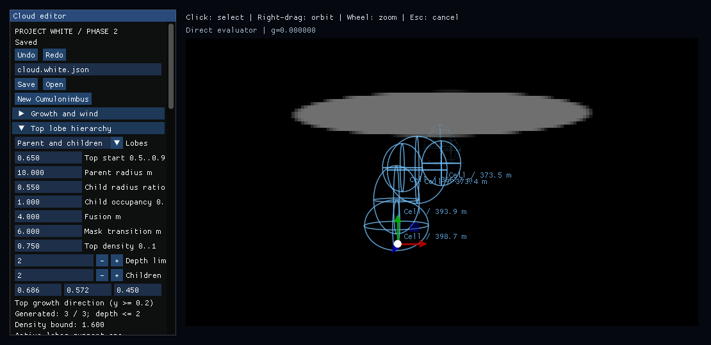

# Anvil completion and requested-cache validation timing

[PR #78](https://github.com/MasafumiYamaguchi/Testbed/pull/78) head
`34a1976de3d953b0f762f5c5a51b4bc3761a557e` passes all four jobs in
[Native run 35535382397](https://github.com/MasafumiYamaguchi/Testbed/actions/runs/35535382397).
The tested merge is `d3718c2a746da64ebc86ea511c582a08ba593193`.
[CPU reference run 35535382510](https://github.com/MasafumiYamaguchi/Testbed/actions/runs/35535382510)
also succeeds. Windows Release's 36 tests, actual input captures, Anvil,
Top, developed-cell, legacy image comparisons and edit benchmark completed.

Release artifact **10614455350**, `windows-Release-evidence`, was downloaded
and its 22,485,985-byte ZIP verified against GitHub's SHA256:
`9d86b2bfc507c36ec688ae236bdf72fb5430c408e05aa9f62d88b60cbadf91a4`.
The files listed in [files-sha256.json](files-sha256.json) are exact extracted
bytes. [Workflow jobs](workflow-jobs.json) and [artifact metadata](workflow-artifacts.json)
record the checked run. This adds completed fallback and slice evidence to the
[historical partial review](https://github.com/MasafumiYamaguchi/Testbed/blob/57af3d530c4cdfe71f65ffac82fccec27597b6e7/docs/evidence/phase2-selection/anvil-pr78-partial/REVIEW.md).
That earlier run at `ff6ed399` failed its 240-second fallback watchdog; its
failure remains part of the record.

## Completed functional evidence

| Check | Result |
|---|---|
| Wide Direct versus requested density cache 128 / sun cache 32 | [Strict comparison](fallback-comparison.txt): linear RGB maximum/mean and T maximum differences are **0 / 0 / 0** |
| Actual fallback mode | [Metadata](wide-fallback-hdr/metadata.json): `cached_density=false`, extent `[0,0,0]`, sun cache resolution 0, empty-space skipping false |
| Anvil field, lower protection, finite support and stage/wind contract | [Contract log](contract.log): PASS |
| Actual width/direction input, one Undo and Save/Open | [Input log](input.stdout.log): all three required PASS markers |
| All 16 OFF/narrow/wide/tilted/wind/manual/young/top front/side fixtures | Numeric checks pass; all 16 PPMs, EXRs and saved inputs are byte-identical to the previously inspected evidence |
| Top with wind density slice | Raw diagnostic PNG/PPM/EXR, metadata and [log](top-wind-slice.stdout.log) are preserved |

[render-equivalence.json](render-equivalence.json) records 48 exact hashes for
the 16 repeated fixture PPMs, EXRs and inputs. It also verifies that the new
fallback PPM and EXR equal the preserved wide-front values byte for byte.
These identical payloads are referenced at the immutable historical evidence
commit rather than duplicated here; every current fixture's metadata and logs
remain separate. The fallback and two actual handle screenshots were opened
again, alongside the new diagnostic slice.

The maximum density-grid, direct-point and rendered-transmittance errors for
the 16 views remain 0.0000135303, 0.00000136584 and 0.00000633408 respectively.
The fallback's grid error is 0.00000584126 against tolerance 0.000082921;
its 256 direct-point error is 0.000000332905 and HDR T error 0.00000394099.

The slice is the fixed **Z=0.5 density plane**, not a projected cloud image or
a view of all support. It shows the broad sheet while most of the curved
column has no visible density in this plane. The wire overlay locates the
editor's 3D handles independently. This image alone does not establish a
detached sheet or prove neck continuity; use the field contract and radiance
views for those distinct checks.

## Successful trace localizes the expensive interval

These are wall-clock intervals in this Windows Basic Render Driver run with
D3D12 validation enabled. They are not GPU hardware timings or controlled RTX
benchmarks. The raw [baseline](wide-front.stdout.log) and
[requested-cache](wide-fallback.stdout.log) logs include flushed stage markers;
[timing-summary.json](timing-summary.json) records their timestamps and simple
end-minus-start differences.

| Measured interval | Wide Direct | Wide requested-cache fallback |
|---|---:|---:|
| GPU initialization | 138.7701 ms | 134.6787 ms |
| Density job submit and fence | 4.6420 ms | 5.2912 ms |
| **Density validation** | **40.321 ms** | **128,966.280 ms** |
| Direct-point validation | 1,181.490 ms | 1,194.000 ms |
| First frame submit-to-fence, logged renderer metric | 20,865.1 ms | 20,077.5 ms |
| Edit to first submission | 1,317.68 ms | 130,258 ms |

The successful fallback's extra delay is concentrated inside density
validation, before the first frame. The original failed run's buffered stdout
was empty, so this does not retroactively prove its final stage or establish
that moving the fallback earlier fixed the underlying cost.

## Independent CPU check of the repeated predicate

The pre-fix `GpuSpike::validate` voxel loop re-evaluates
`scene_density_requires_direct(scene_snapshot_)` when fixture 2 requests a cache.
For one active anvil or top, that predicate constructs the evaluation plan;
multiple developments return early. The scene does not change during the loop.
At the recorded 65×67×69 extent this is **300,495 repeated predicate calls**.
[PR #84](https://github.com/MasafumiYamaguchi/Testbed/pull/84) moves the invariant
decision before the loop while retaining every voxel, error comparison and
tolerance. This review independently checked that source path; native evidence
for the fix remains a separate run.

[predicate-timing.cpp](predicate-timing.cpp) and its unedited
[output](predicate-timing.log) measure the predicate on the saved wide anvil,
top-children and two-cell Scenes, using the existing Linux Release core library
and GCC 13.3.0 with `-O3 -DNDEBUG`, without GPU work.

| Calls | Wide anvil | Top children | Two developments |
|---:|---:|---:|---:|
| 1,000 | 312.951561 ms | 150.396729 ms | 0.002474 ms |
| 2,000 | 627.382819 ms | 297.423346 ms | 0.004928 ms |
| 4,000 | 1,209.094845 ms | 647.721590 ms | 0.009764 ms |

The approximately linear growth and cheap two-cell early return support the
observed mechanism. Extrapolation to 300,495 calls gives roughly 91–94 seconds
for the anvil on this Linux host, **not a measured full-grid or Windows time**.
See [predicate-provenance.json](predicate-provenance.json) for exact input,
source and linked-library hashes. This is a diagnostic measurement, not a new
performance gate.

## Acceptance boundary

The numeric fallback and diagnostic-slice gaps in the earlier partial run are
now covered at head `34a1976`. Naturalness remains **Hold**: the thin elliptical
sheet and narrow-waisted rounded column expose the construction, the top
protrusions are small, and these detail-disabled 192×108 fixtures with one light
cannot establish convincing finished edge breakup or illuminated depth. The
previous three appearance findings still apply to the byte-identical views.
Active multi-development anvils remain unsupported. Physical RTX validation,
naturalness approval, main merging and Issue closure are not claimed here.
