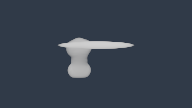
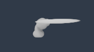
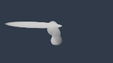
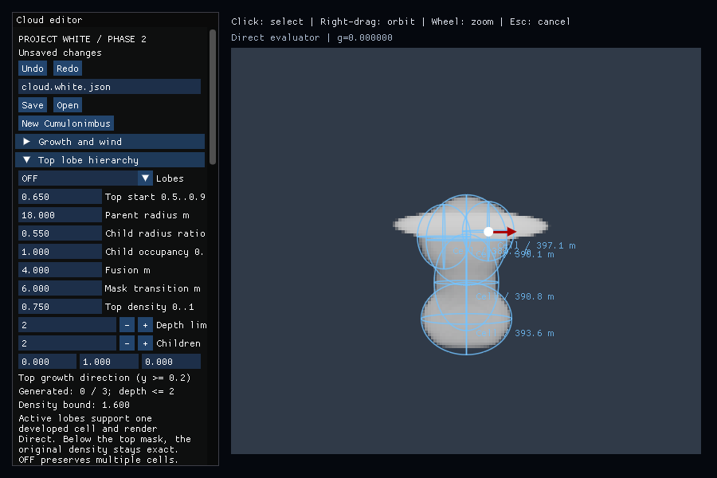

# Anvil comparison review: completed fixtures, failed fallback run

This is partial evidence from [Native run 35532876269](https://github.com/MasafumiYamaguchi/Testbed/actions/runs/35532876269),
PR #78 head `ff6ed399700f8925a0929bdec3f0a6f9291f1881`, tested merge
`a5a7dcf55f5c665cdd9a1a1b2a3b080592dd85db`. Windows Debug and CPU Debug/Release
passed. Windows Release failed when `wide-fallback` exceeded its 240-second
timeout. All 16 preceding front/side fixture runs and the actual input test
completed. This is not a passing Release result or a verified cache-fallback
comparison. The later slice was not reached.

Artifact `10612179406` ZIP SHA256 was verified after download:
`1eea7554aff8c90bde193e9bb66d22defeca7d05caf8f3661fdfe643b7d34051`.
`files-sha256.json` records unmodified extracted inputs, logs, PPMs, EXRs,
metadata and one actual editor BMP. `numeric-summary.json` is derived from the
raw logs. No synthetic screenshot or image reconstruction is included. The
script failed before its final BMP-to-PNG conversion, so original rendered PPMs
and BMP are retained. Five later PNG derivatives provide browser previews:
Pillow changed the container format only, and decoded mode, dimensions and every
pixel were checked for exact equality. No resizing or appearance change was
applied; `derived-png/provenance.json` records source/output hashes. The renderer reports Microsoft Basic Render Driver /
D3D12 with validation layers enabled; this is not physical RTX validation.

## Verified behavior before the timeout

All 16 raw rendered PPM views were opened: OFF, narrow, wide, tilted, wind,
manual override, young stage and wind with top lobes, each front and side.
Two actual handle BMP captures were also opened; the direction result is kept
here. The input log verifies width-handle/Inspector command equality and one
Undo, direction-handle/Inspector command equality and one Undo, and source
Save/Open. Saved JSONs preserve the evaluated state and test metadata records
the exact build commit.

The views show a wider horizontal extension from narrow to wide, changed
projected direction under tilt/shear, common wind deformation of the column
and anvil, and a different manual direction despite the same wind-bent trunk.
The young stage has shorter vertical and horizontal reach. The top-lobe case
adds a small protrusion above the sheet. No detached sheet or support clipping
is visible in these views, but image inspection alone is not a proof over all
accepted settings.

| OFF, front | Wide, front |
|---|---|
|  |  |

| Shared wind, front | Shared wind, side |
|---|---|
|  |  |

## Numeric scope

| Completed-fixture check | Largest observed error |
|---|---:|
| Full density-grid CPU/GPU absolute error | 0.0000135303 |
| Direct-point CPU/GPU absolute error, 256 points per active-anvil fixture | 0.00000136584 |
| HDR CPU/GPU transmittance maximum error | 0.00000633408 |

Each density error is below its source-specific logged tolerance; the largest
density error occurs in the wind fixtures with tolerance 0.0000968293. All
16 metadata files report Direct density, no sun cache and no empty-space skip.
They use 192×108 pixels, 80 view steps and 8 shadow steps. That does not prove
the requested-cache path: `wide-fallback` has no captured HDR or completed
comparison. Its stdout is empty and stderr contains only renderer startup
identification; a killed buffered process does not establish where it stalled.

## Appearance findings for Issues 33/41

Naturalness remains **Hold**. The three findings are:

1. **Large shape:** the narrow-waisted column and flattened elliptical sheet
   clearly expose the primitive construction. Horizontal reach is controllable,
   but the result still resembles a smooth lens on stacked rounded masses.
2. **Connection and lobes:** the sheet has a regular thin rim and the additional
   top hierarchy produces only small visible protrusions. A coherent range of
   billow sizes and a less mechanical column-to-anvil transition are not yet
   demonstrated by these settings.
3. **Detail and lighting evidence:** these contract fixtures intentionally have
   detail disabled, use one fixed light, and render at 192×108. They establish
   silhouette/control differences but cannot establish finished edge breakup or
   convincing illuminated cloud depth. Review finishing and alternate lighting
   separately; do not attribute all smoothness to a missing implementation.

The failed cache-request fixture and later slice still require a corrected
run. Physical-device performance and the multi-development active-anvil case
remain outside this evidence.
