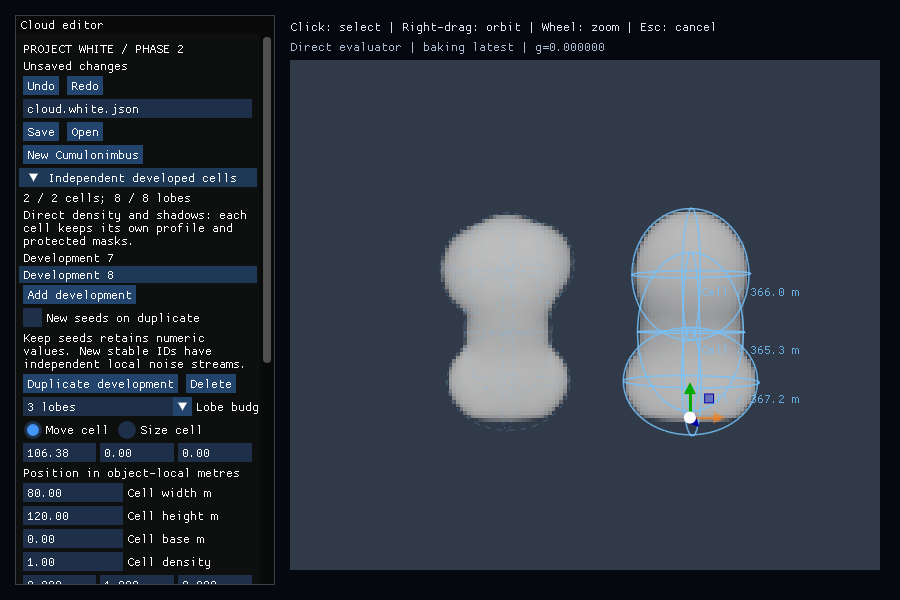
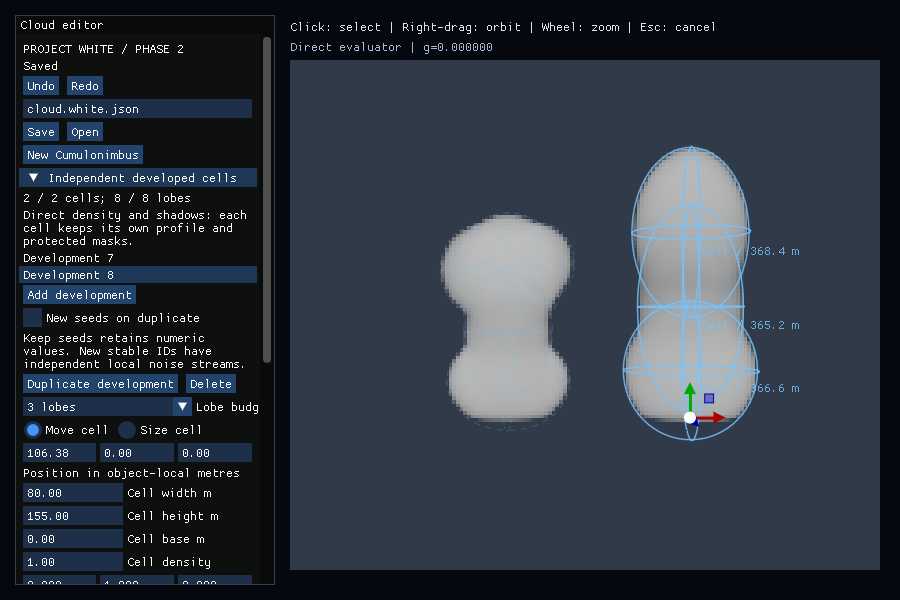
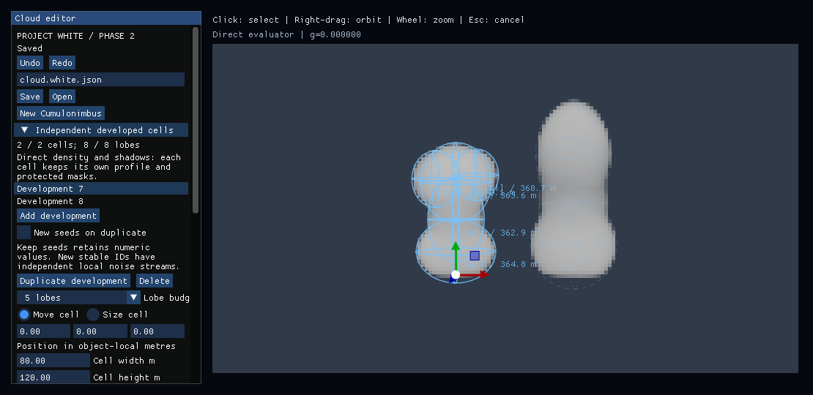
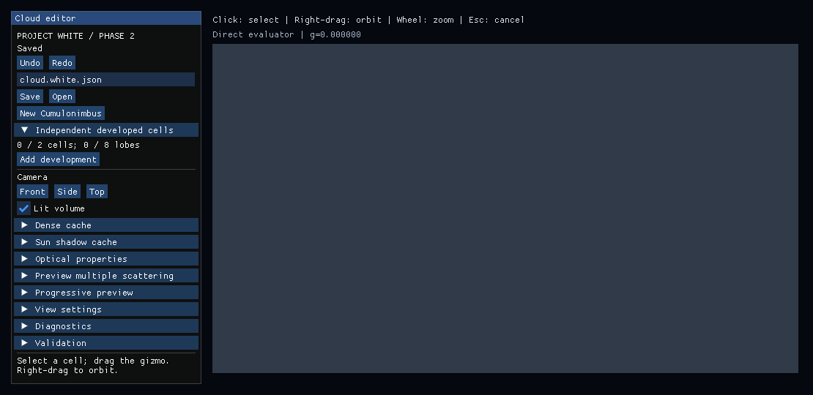

# Independent-development Windows verification

[Native Actions run 35530527905](https://github.com/MasafumiYamaguchi/Testbed/actions/runs/35530527905)
passed all four Windows/CPU Debug/Release jobs. PR #76 head is
`864e0e5c6e540bce3dc0d39ba9e67f0cb77e8a4e`; the tested merge is
`048fa4c1d532cafc49c15ee7876c2dc0b70358e4`.
The current-head [CPU reference run 35530527906](https://github.com/MasafumiYamaguchi/Testbed/actions/runs/35530527906)
also passed; grouped reference MC remains explicitly unsupported.

Release artifact `10611991159` ZIP SHA256 was verified after download:
`8fe2f39afc96f4bd5cf05e7c30bf7c98c23194c0e19ec3ee7598ae06ecbfd1b8`.
The PNGs, saved sources, HDR/metadata and raw logs here are unmodified extracts.
The renderer's unadorned `display.ppm` images are preserved beside the HDR files.
`files-sha256.json` identifies their bytes; this review is added separately.
The runner reports Microsoft Hyper-V Video, D3D12, and no hardware GPU timestamp.

## Actual input and persistence

The original scripted release event could substitute the desktop pointer
position and move the development backwards. The corrected replay keeps the
scripted pointer position through release. The real application screenshot now
shows the selected second development moved from X=90 to X=106.38. Its subsequent
height changes from 120 to 155 while the first development retains its shape.
The log confirms equality with the corresponding typed command, a single
Undo/Redo, saved-source reload, deletion Undo and transparent empty state.

| After real drag | After independent height edit and Save/Open |
|---|---|
|  |  |

## Numerical results

| Check | Result |
|---|---:|
| Largest grouped voxel error during input sequence | 0.0000143945 |
| Its documented tolerance | 0.000181332 |
| Largest direct-point error during input sequence | 0.000000876817 |
| Direct-point samples per probe | 256 |
| Two-development HDR CPU/GPU transmittance maximum error | 0.00000222933 |
| Direct versus requested density/sun/skip cache: linear RGB maximum/mean and T maximum | 0 / 0 / 0 |
| Empty HDR CPU/GPU transmittance maximum error | 0 |

The requested acceleration path correctly remains Direct for two developments.
One development restores the 128-cubed dense path. The standalone comparison
HDRs use 160×90 pixels, 64 view steps and 8 shadow steps. The input sequence's
editor viewport uses 160×138; those are separate captures, not interchangeable
image comparisons. Windows CTest passed 30 core contracts and 2 CLI checks.

| Two independently edited developments | Empty developed source |
|---|---|
|  |  |

## Visual review and limits

Six captures were opened: initial, moved, stretched, two-development Direct,
single-development dense and empty. They confirm the intended editing and
rendering states. The default shapes visibly retain smooth ellipsoid clusters
with a narrow connection; this is functional evidence, not a natural-cloud
acceptance. The new contact/coincident fixtures and independent fusion controls
are in PR #77 rather than this tested head. Physical RTX performance and Issue
acceptance remain separate.
