# Growth, wind and top-lobe comparison review

[Native run 35531174858](https://github.com/MasafumiYamaguchi/Testbed/actions/runs/35531174858)
passed all Windows/CPU Debug/Release jobs for PR #77 head
`1b1566654fea282c838aae89944d728ea8f1ed61`, tested merge
`b9e24dfbf81176f07f72c674bbc893f8d5ed9da8`. The separate
[CPU reference run 35531174856](https://github.com/MasafumiYamaguchi/Testbed/actions/runs/35531174856)
also passed. Windows CTest passed 33 core contracts and 2 CLI checks.

Release artifact `10612453999` ZIP SHA256 was verified after download:
`65b89dfa6f4c5008c1c2f29882e020ae8c011a47521464b86389d5d88bdb0024`.
The saved PNGs, PPM/EXR render outputs, Scene JSONs, metadata and raw logs are
unmodified extracts identified by `files-sha256.json`. Inline images below are
lossless PNG container conversions of the actual rendered PPMs. Decoded mode,
dimensions and every pixel match their originals; no resize, color adjustment,
annotation or retouching was applied. `derived-png/provenance.json` records hashes.
`numeric-summary.json` is a separate derived summary of the preserved logs.

## Shared inputs and visible growth

One isolated development uses the same initial Scene, structure seed 42 and
detail seed 17. The initial nominal height is 120 m, width 80 m, cloud base 0 m;
the active hierarchy is one parent and two children. `growth/initial.white.json`
preserves this source, and each evaluated front/side Scene is saved separately.
The exact generating code is
[`tests/generation_tests.cpp` at the tested head](https://github.com/MasafumiYamaguchi/Testbed/blob/1b1566654fea282c838aae89944d728ea8f1ed61/tests/generation_tests.cpp).

| Generation input | Value |
|---|---|
| Generation algorithm | 1; dimensionless selected stage |
| Compared stages | 0.35 and 1 |
| Initial-height fraction | 0.4 |
| Wind reference | Fixed local base 0 m, height 120 m |
| Calm wind | Zero displacement at both endpoints |
| Shear wind `(normalized altitude, X/Y/Z displacement)` | `(0, [0,0,0])`, `(0.5, [20,0,5])`, `(1, [70,0,25])` |
| Displacement units | Object-local metres at stage 1, not metres/second |
| Development 7 | Onset 0, amount 1, no pinned controls |
| Whole-object reference translation | Zero |

Both candidates at a given stage retain identical initial composition and seed.
Camera and light are identical within each view across wind/stage variants.
The selected height grows from 68.286 m to 120 m. The mature shear case visibly
bends the upper structure downwind while the bottom remains in place. Young
shear is subtle under this fixed height reference, especially from the side.
This is evidence of a nonuniform selected-state change, not meteorological time.

| Stage/view | Calm | Altitude shear |
|---|---|---|
| 0.35, front |  |  |
| 1, front | 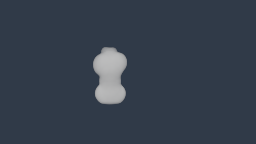 | 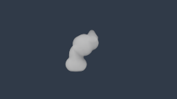 |
| 0.35, side | 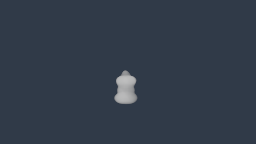 | 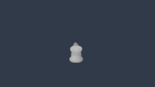 |
| 1, side | 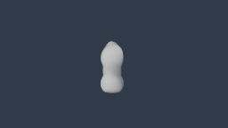 | 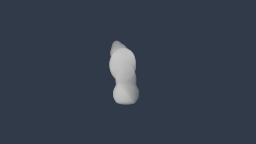 |

## Top-only hierarchy and independent masks

The top comparisons use the same camera/light in each view. OFF, one parent and
parent plus two children preserve the lower shape. The input log confirms exact
lower-density protection, unchanged topology after detail reseeding, single
Undo and source Save/Open. The saved top density slice is also inspected.
Active hierarchy uses Direct rendering; requesting unsupported caches produces
exactly the same linear RGB and transmittance output.

| View | OFF | Parent | Parent and children |
|---|---|---|---|
| Front |  |  |  |
| Side | 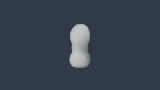 | 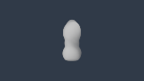 | 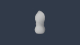 |

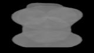

Contact X=35 and coincidence X=0 fixtures retain separate bases, a cut only in
the first development, and a separate density profile in the second. The field
and direct-point checks pass with those masks; the union remains bounded.

| Contact, X=35 | Coincident, X=0 |
|---|---|
| 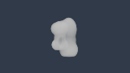 | 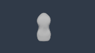 |

## Numeric and timing scope

| Preserved comparison family | Largest density-grid error | Largest direct-point error | Largest HDR transmittance error |
|---|---:|---:|---:|
| Growth / wind | 0.00000953674 | 0.000000923377 | 0.00000285248 |
| Top hierarchy, including input/detail-seed capture | 0.00000837445 | 0.00000132166 | 0.00000277915 |
| Contact/coincidence and two-development fallback | 0.000010848 | 0.00000253745 | 0.00000222933 |

All errors pass their logged source-specific tolerances. Both the top-hierarchy
and two-development requested-cache comparisons have linear RGB maximum/mean
and transmittance maximum differences of exactly zero. Growth views use
256×144 pixels, 96 view steps and 12 shadow steps. Top and overlap lit views
use 160×90 pixels, 64 view steps and 8 shadow steps. The diagnostic slice is a
different mode and is not treated as a lit HDR comparison.

The four structural generation calls report 6.3204–6.8561 ms CPU elapsed time.
Their input hashes and conservative support/rho_max are in the original
`generation-manifest.json`. These times are separate from field generation and
render submit/fence time. The renderer uses Microsoft Basic Render Driver /
D3D12 with validation layers; the OS adapter listing reports Hyper-V Video.
No physical RTX performance or hardware GPU timestamp is established.

## Early shape review: three findings for Issues 33/41

All eight growth views, six hierarchy views, the slice and both overlap views
were opened, together with the actual mature-shear application screenshot.
Naturalness remains **Hold**, even though the numerical and interaction gates
pass. Review order and findings are:

1. **Large shape:** stage and upper bending are visible, but the column still
   has a pronounced narrow waist between smooth rounded masses. It reads as an
   arranged primitive structure rather than a convincing cumulonimbus body.
2. **Lobe structure:** OFF→parent→children changes small upper protrusions;
   the side-view difference between parent and children is particularly weak.
   The fixed three-node budget and these settings do not demonstrate a rich
   range of coherent billow sizes. Multi-development active tops are still
   unsupported and are not counted as tested.
3. **Detail and illumination:** the growth fixtures contain bounded detail,
   but at this framing and resolution the mass remains nearly smooth and
   weakly shaded. This single light cannot separate every lighting deficiency
   from shape/detail weakness. Inspect closer views and alternate lighting of
   the same frozen structure before judging finishing quality; do not infer
   naturalness from a low-resolution numeric comparison.

These findings complete the early comparison record, not Issue #31 appearance
acceptance or the later Freeze integration gate.
