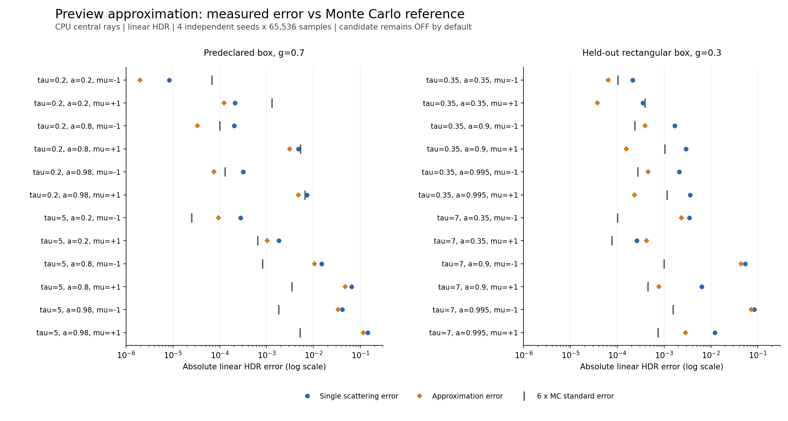

# Preview multiple-scattering candidate: CPU comparison

**Decision: opt-in only; default OFF. No parameters were fitted to these results.**

This report compares central-ray linear HDR in a frozen, homogeneous R32F medium. It does not measure native GPU appearance, GPU cost, or editing latency. All models share the same density, optical parameters, sun irradiance, and primary background. Exposure and tone mapping are absent from the numerical comparison.

The candidate adds two attenuated single-scattering octaves with fixed strength 0.5, extinction scale 0.5 and anisotropy scale 0.5. The analytic OFF baseline and the 2,048-step ON quadrature are compared with a multiple-scattering MC reference using four independent seeds. The approximation is not unbiased.

| Set | Cases | OFF RMSE | ON RMSE | Resolved better / worse / unresolved |
| --- | ---: | ---: | ---: | --- |
| All | 24 | 0.0394770 | 0.0317715 | 16 / 1 / 7 |
| Predeclared | 12 | 0.0475224 | 0.0376582 | 6 / 0 / 6 |
| Held out | 12 | 0.0293000 | 0.0245096 | 10 / 1 / 1 |

An ordering is called resolved only when the MC mean lies more than six estimated standard errors from the midpoint of OFF and ON. Since ON is at least OFF, a mean above that midpoint favors ON. This is a descriptive uncertainty diagnostic, not a confidence guarantee or a generalization claim. RMSE values are point estimates over this specific set, with equal weight per case.

There are 23 point-estimate improvements, but seven orderings are unresolved by this diagnostic. The held-out tau=7, albedo=0.35, g=0.3, cosine=+1 case worsens: OFF error 0.000262735; ON error 0.000421715. ON overshoots the MC mean. The held-out tau=7, albedo=0.995, g=0.3, cosine=-1 case still has ON error 0.0722773 (about 280 MC standard errors). That deficit is much larger than both the measured sampling noise and the quadrature change. Thick media and geometry-dependent sideways light transport remain major limitations.

Each point shows an absolute error against the same MC mean. The grey tick shows six estimated MC standard errors; it is a scale marker, not an error of the reference or a measured upper bound. The logarithmic horizontal axis keeps small thin-medium errors visible alongside thick-medium errors.

## Reproduction and limits

`white_preview_reference_tests 65536 > comparison.csv 2> comparison.log`

- 6,291,456 total paths: 65,536 samples per seed, four seeds, 24 cases.
- Seeds: 17, 42, 4,294,967,313 and 99,991. Each seed mean and standard error is retained in the CSV.
- Path cap: 256 bounces and 1,000,000 tracking events per tracking call; incomplete paths fail the executable.
- Predeclared: box bounds [-1,1] on all axes; tau 0.2/5; albedo 0.2/0.8/0.98; g=0.7; cosine -1/+1.
- Held out: bounds [-0.75,0.75] x [-0.5,0.5] x [-1,1]; tau 0.35/7; albedo 0.35/0.9/0.995; g=0.3; cosine -1/+1.
- Camera ray: (0,0,-3) toward +Z, world interval [0,10]; constant 8x8x8 density=1; extinction=tau/2.
- Maximum absolute 1,024/2,048-step ON quadrature change: 4.9909229e-08.
- Total recorded sampling wall time: 22.005 seconds. It is CPU time on this host, not a GPU benchmark.
- Default executable sample count is 4,096 per seed for bounded CI runs. Sample count changes MC uncertainty only.

[Full numeric CSV](comparison.csv), [completion log](comparison.log), [protocol and source hashes](protocol.json), [model ADR](../../adr/0022-preview-approx.md).

The reference has finite sample count and uses weighted absorption plus Russian roulette. Estimated standard errors can themselves be noisy, especially for rare paths. The report exposes all seeds and does not claim a proven deterministic error bound. All boxes are homogeneous; heterogeneous cloud image comparisons and measured GPU costs are still required before considering default adoption.
