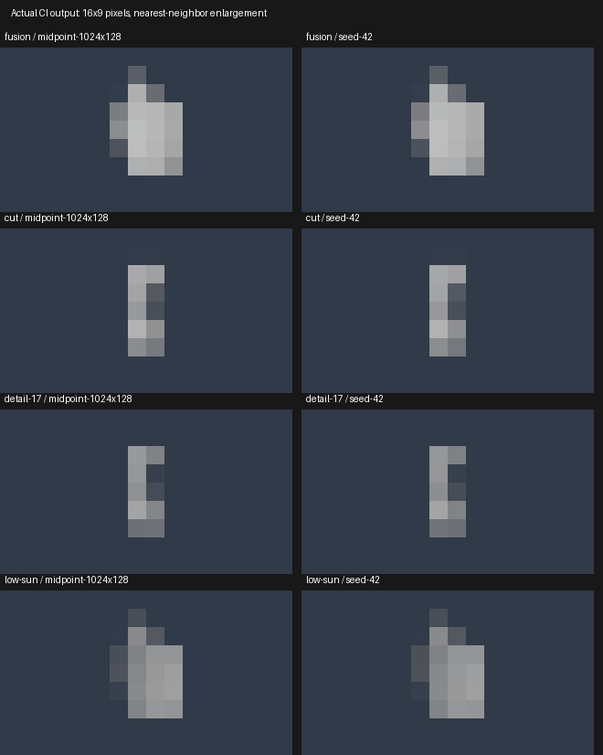

# Verified same-grid reference image comparison

[CPU reference Actions 35426407735](https://github.com/MasafumiYamaguchi/Testbed/actions/runs/35426407735) passed for PR #75 head `61aeb9fe629efc6e93d8499748a42997c2cf78d9`, tested merge `ee28ee870cca9f3d7af6dd16e308d8e3c838f43f`.
Artifact10577949297 ZIP SHA256 `5b5c0c37931068e822b883a08854ab09ac5e96aa3b1827e04df8a3f8c259c6aa` verified after download.

All18,874,368 paths completed in10.49seconds. Four heterogeneous saved scenes, four independent64-bit seeds,8192samples per seed,16x9 fixed pixel centers, one exact32-cubed R32F array per scene. No jitter/denoising/sun cache/preview approximation. Midpoint refinement is reported separately from MC uncertainty. The80-rowCSV includes1024/8192spp checkpoints and RGB-average/T statistics; image-level uncertainty gates passed. These tiny images are numerical diagnostics, not final image-quality acceptance or GPU equality.

| Scene | Combined RGB RMSE | Expected MC RMSE | Quadrature refinement RMSE |
|---|---:|---:|---:|
| fusion | 0.00074192 | 0.000873641 | 3.8232e-06 |
| cut | 0.000625331 | 0.000567665 | 4.80017e-05 |
| detail-17 | 0.000558321 | 0.000483141 | 2.99043e-05 |
| low-sun | 0.000294764 | 0.0004316 | 1.02143e-06 |

Representative midpoint and seed42 linear EXR/metadata/PNG, exact little-endian frozen density bytes, scene and combined per-pixel statistics are preserved. Full per-seed/checkpoint bundles are in the workflow artifact. All eight representative images were opened for review.

